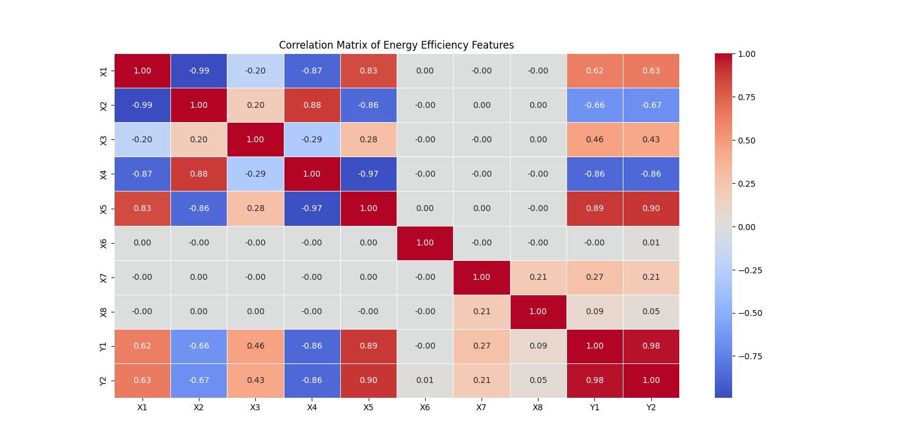

# Machine Failure Time Prediction

This project predicts the failure time of machines using regression models. The model's performance is evaluated based on its accuracy for two target variables: Heating Load (Y1) and Cooling Load (Y2).

## Results

- **Total Combined Accuracy:** 90.27%
- **Heating Load (Y1) Accuracy:** 91.22%
- **Cooling Load (Y2) Accuracy:** 89.32%

## Visualizations

### Prediction vs Data Points

The following figure shows the prediction line over the actual data points:


### Covariance Matrix

The correlation between features is visualized in the following heatmap:



## How to Run

1. Ensure you have Python installed.
2. Install required packages (see code for dependencies).
3. Run the prediction script:
   ```bash
   python prediction.py
   ```

## Files
- `prediction.py`: Main script for training and evaluating the model.
- `figure_1.png`: Visualization of predictions vs actual data.
- `corelation.png`: Covariance matrix heatmap.

## Author
- [NithishKumar A]
